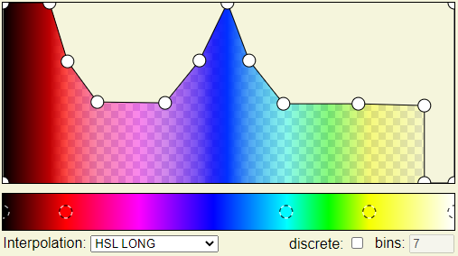
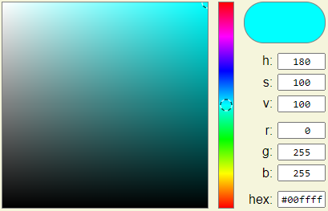
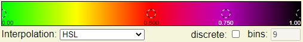
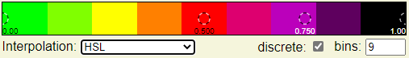
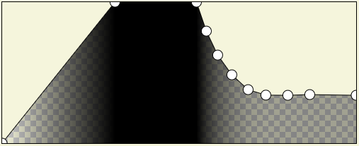

# Transfer Function Editor

This library provides components for creating and modifying, colors, color maps, transparencies and transfer functions.
It is based on d3 and requires no framework like React or Vue.js.

Example: https://dlr-sc.github.io/transfer-function-editor/

## Components

### Color Picker

The color picker component allows to choose a color with a hue, saturation value picker. It also provides input via
input fields for hsv, rgb and hex. 

### Color Map Editor

The color map editor allows creation of discrete and continuous color maps with different interpolation methods.

### Transparency Editor

The transparency editor allows to create functions that map transparency onto values.

### Transfer Function Editor

This component brings all previous components together to create a powerful tool for managing all possible transfer
functions.
